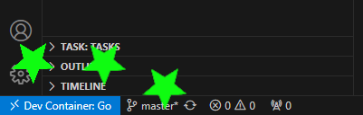

# Go OpenAPI-generated Web Service in Dev Container

This repository contains a Go web service example project that is meant to be ran in a [dev container](https://code.visualstudio.com/docs/devcontainers/containers).

## Prerequisites

- [Install Docker](https://docs.docker.com/get-docker/)
- [Install VSCode](https://code.visualstudio.com/) with [Dev Containers extension](https://marketplace.visualstudio.com/items?itemName=ms-vscode-remote.remote-containers)

## Getting Started

1. Clone this repository:
   ```shell
   git clone https://github.com/ericslandry/webapi.git
   ```
2. Open the repository in VSCode:
   ```shell
   code webapi
   ```
3. Reopen the repository in a container:
      - Click on the green icon in the bottom left corner of the window and select `Reopen in Container`.
      - Alternatively, you can open the command palette (Ctrl+Shift+P) and type `Remote-Containers: Reopen in Container`.

   After a reload, VSCode should display "Dev Container: Go" at the bottom left:
   

4. Run the `default` [Taskfile](https://taskfile.dev/) target:
   ```shell
   task
   ```
   See `Taskfile.yml` for more details on the various targets or run `task --list`.
